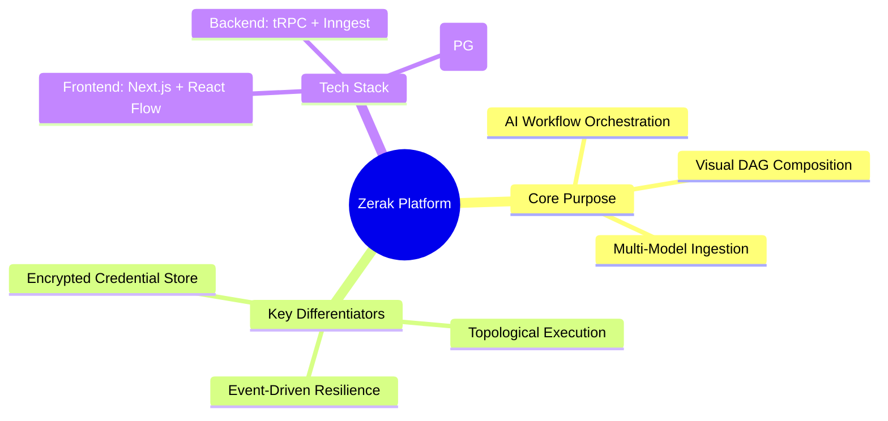
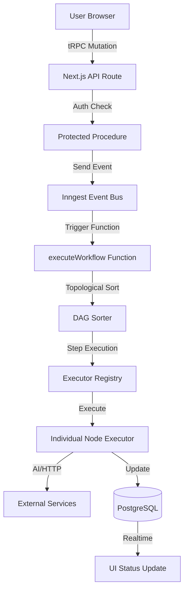
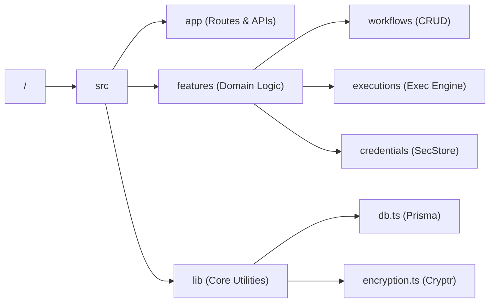
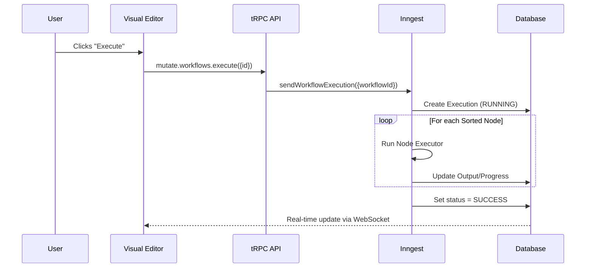
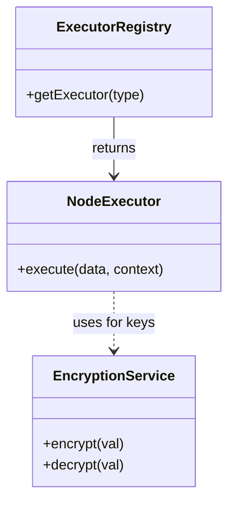
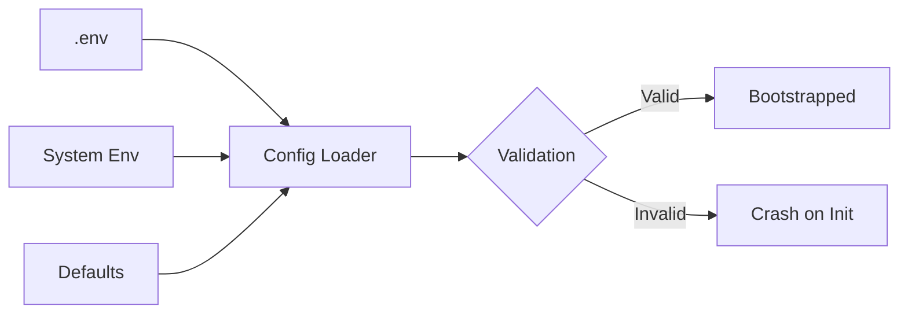
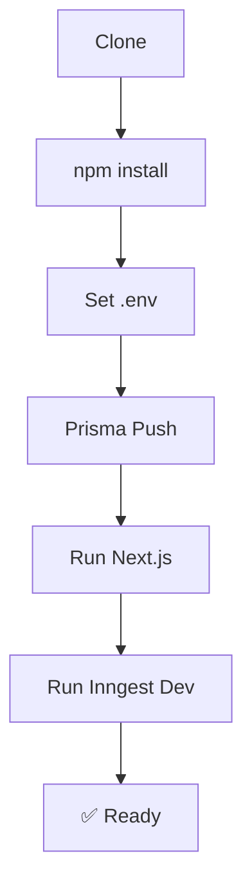
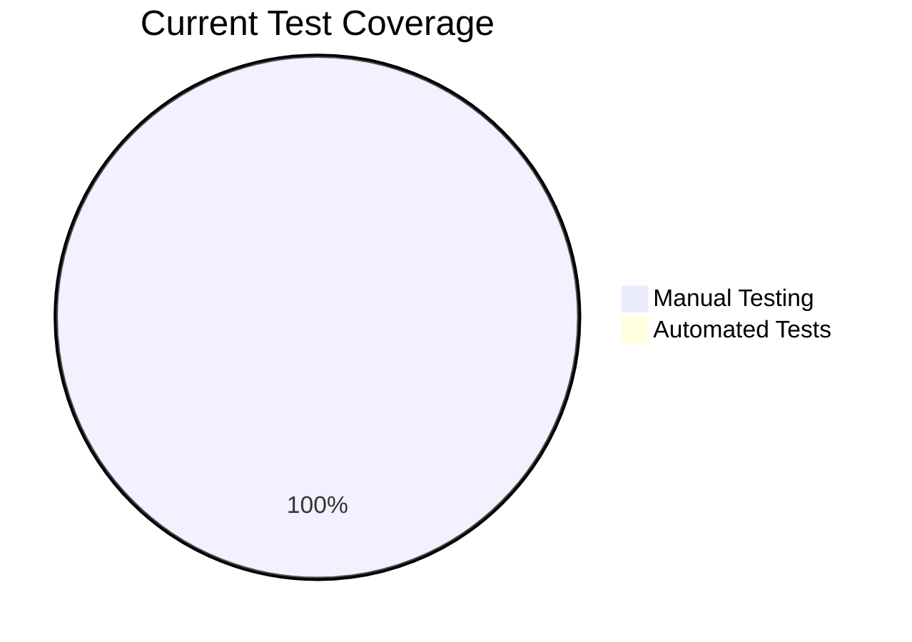
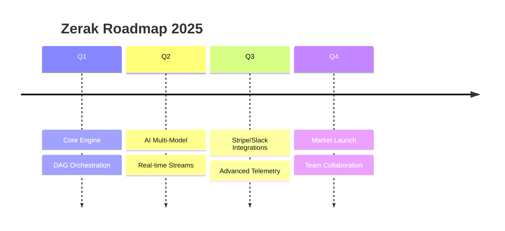

# 🤖 Zerak — AI-Native Workflow Automation Platform

[](https://github.com)
[](#)
[](#)
[](#)
[](#)

**Zerak** is a production-grade, AI-native orchestration platform that enables users to compose, visualize, and execute complex automation workflows. It integrates multiple AI providers (OpenAI, Anthropic, Gemini), content ingestion, and event-driven triggers into a unified visual DAG editor.

> **PR Review Style Note:** *This project solves the "glue code" problem of modern AI applications by providing a robust execution engine. Notably, the author chose **event-driven async execution via Inngest** over synchronous request-response—a deliberate tradeoff that ensures resilience for long-running AI inferences at the cost of slight eventual consistency in UI updates (mitigated by real-time WebSocket streams).*

%%{init: {"theme": "base", "themeVariables": { "primaryColor": "#fff", "edgeColor": "#000", "lineColor": "#000", "textColor": "#000", "mainBkg": "#fff", "nodeBorder": "#000" }}}%%


---

## 📐 Architecture Overview

Zerak follows a **decoupled definition-execution architecture**. Workflow definitions are managed via tRPC, while executions are handled asynchronously by Inngest. This separation ensures that the visual editor remains responsive even during heavy execution loads.

%%{init: {"theme": "base", "themeVariables": { "primaryColor": "#fff", "edgeColor": "#000", "lineColor": "#000", "textColor": "#000", "mainBkg": "#fff", "nodeBorder": "#000" }}}%%


> **CodeRabbit Walkthrough:** *The request enters at the tRPC `execute` procedure, gets validated against the user session, and transformed into an Inngest event. The `executeWorkflow` function ([src/app/api/inngest/functions.ts:15](./src/app/api/inngest/functions.ts:15)) then pulls the full DAG, performs a topological sort to handle dependencies, and iterates through nodes using the `executorRegistry`.*

---

## 📁 Repository Structure

The project follows a **feature-sliced directory structure**, grouping logic by domain (workflows, executions, credentials) rather than just technical type.

%%{init: {"theme": "base", "themeVariables": { "primaryColor": "#fff", "edgeColor": "#000", "lineColor": "#000", "textColor": "#000", "mainBkg": "#fff", "nodeBorder": "#000" }}}%%


- **[src/features/workflows](./src/features/workflows)**: Manages DAG definitions, visual editor state, and prompt-to-workflow generation.
- **[src/features/executions](./src/features/executions)**: Contains the core node execution logic and the [executor-registry.ts](./src/features/executions/lib/executor-registry.ts).
- **[src/lib/encryption.ts](./src/lib/encryption.ts)**: 💡 **Note:** Uses `cryptr` with an `ENCRYPTION_KEY` to ensure all external API keys (OpenAI, etc.) are never stored in plain text.

---

## 🔄 Data Flow & State Management

Zerak utilizes a **unidirectional data flow** for executions. The state of a workflow execution is persisted in PostgreSQL and broadcasted via Inngest's real-time middleware.

%%{init: {"theme": "base", "themeVariables": { "primaryColor": "#fff", "edgeColor": "#000", "lineColor": "#000", "textColor": "#000", "mainBkg": "#fff", "nodeBorder": "#000" }}}%%


> **CodeRabbit Observation:** *State is colocated at the feature level using Jotai atoms ([src/features/editor/store/atoms.ts](./src/features/editor/store/atoms.ts)). This reduces global re-renders while allowing the React Flow canvas to stay in sync with the property panels.*

---

## 🧩 Core Modules & APIs

### 1. Execution Engine
- **Purpose**: Topologically sorts and executes DAG nodes.
- **Implementation**: Uses a registry pattern to decouple node logic from the orchestrator.
- **Clever Choice**: The engine passes a `context` object between steps, allowing nodes to reference previous outputs using Handlebars syntax (e.g., `{{nodeName.variable}}`).

### 2. Security / Encryption
- **Purpose**: Encrypts sensitive credentials at rest.
- **Interface**: `encrypt(text: string)`, `decrypt(text: string)`.
- **Note**: Implementation ([src/lib/encryption.ts](./src/lib/encryption.ts)) ensures that even if the database is compromised, API keys remain protected.

%%{init: {"theme": "base", "themeVariables": { "primaryColor": "#fff", "edgeColor": "#000", "lineColor": "#000", "textColor": "#000", "mainBkg": "#fff", "nodeBorder": "#000" }}}%%


---

## ⚙️ Configuration & Environment

| Variable | Type | Required | Description |
|----------|------|----------|-------------|
| `DATABASE_URL` | String | Yes | PostgreSQL connection string (Neon recommended) |
| `ENCRYPTION_KEY` | String | Yes | Key for `cryptr` to encrypt/decrypt credentials |
| `GITHUB_CLIENT_ID` | String | Yes | Better-Auth GitHub Provider |
| `GITHUB_CLIENT_SECRET` | String | Yes | Better-Auth GitHub Provider |
| `GOOGLE_CLIENT_ID` | String | Yes | Better-Auth Google Provider |
| `GOOGLE_CLIENT_SECRET` | String | Yes | Better-Auth Google Provider |
| `ANTHROPIC_API_KEY` | String | Yes | Used for prompt-to-workflow generation |
| `NEXT_PUBLIC_APP_URL` | String | No | Defaults to `http://localhost:3000` |
| `INNGEST_EVENT_KEY` | String | No | For production Inngest events |
| `INNGEST_SIGNING_KEY` | String | No | For production Inngest signing |

%%{init: {"theme": "base", "themeVariables": { "primaryColor": "#fff", "edgeColor": "#000", "lineColor": "#000", "textColor": "#000", "mainBkg": "#fff", "nodeBorder": "#000" }}}%%


---

## 🚀 Getting Started

### Prerequisites
- Node.js 20+
- PostgreSQL instance
- Inngest CLI (`npm install -g inngest-cli`)

### Setup
1. **Clone & Install**:
   ```bash
   git clone https://github.com/your-repo/zerak.git
   cd zerak
   npm install
   ```
2. **Database Setup**:
   ```bash
   npx prisma generate
   npx prisma db push
   ```
3. **Run Development Stack**:
   - Terminal 1: `npm run dev`
   - Terminal 2: `npm run inngest:dev`

%%{init: {"theme": "base", "themeVariables": { "primaryColor": "#fff", "edgeColor": "#000", "lineColor": "#000", "textColor": "#000", "mainBkg": "#fff", "nodeBorder": "#000" }}}%%


---

## 🧪 Testing Strategy

> **CodeRabbit Review Tone:** *The current codebase lacks automated test suites. This is a significant risk for the execution engine, where topological sort edge cases could lead to infinite loops. **Recommendation:** Implement unit tests for `topologicalSort` in [src/app/inngest/utils.ts](./src/app/inngest/utils.ts) immediately.*

%%{init: {"theme": "base", "themeVariables": { "primaryColor": "#fff", "edgeColor": "#000", "lineColor": "#000", "textColor": "#000", "mainBkg": "#fff", "nodeBorder": "#000" }}}%%


---

## 🔐 Security Model

Zerak enforces strict RBAC (Role-Based Access Control) via `protectedProcedure` ([src/trpc/init.ts:26](./src/trpc/init.ts:26)).

1. **Authentication**: Handled by **Better-Auth** with OAuth2 providers.
2. **Authorization**: Every database query includes a `userId` filter to prevent cross-tenant data access.
3. **Data Integrity**: Credentials are encrypted before persistence and only decrypted at the moment of execution inside the serverless function environment.

---

## 📊 Performance & Observability

- **AI Telemetry**: All AI nodes utilize `experimental_telemetry` ([src/features/executions/components/gemini/executor.ts:107](./src/features/executions/components/gemini/executor.ts:107)) to record inputs and outputs for auditing.
- **Execution Resilience**: Inngest provides automatic retries for transient failures, though currently set to 0 in development for faster debugging ([src/app/api/inngest/functions.ts:18](./src/app/api/inngest/functions.ts:18)).

---

## 🗺️ Roadmap & Known Issues

- [ ] **Technical Debt**: ⚠️ The retries in `executeWorkflow` are disabled. This must be configured before production deployment to handle AI rate limits.
- [ ] **Feature**: Stripe Executor implementation (Currently uses `manualTriggerExecutor` as placeholder).
- [ ] **Feature**: Cycle detection during workflow saving in the frontend.
- [ ] **Feature**: Cost estimation for AI tokens before execution.

%%{init: {"theme": "base", "themeVariables": { "primaryColor": "#fff", "edgeColor": "#000", "lineColor": "#000", "textColor": "#000", "mainBkg": "#fff", "nodeBorder": "#000" }}}%%


---

<!-- CodeRabbit-style note: Detected a potential issue where topologicalSort is imported from @/app/inngest/utils but cyclic dependency checks might be bypassed in the visual editor's save mutation. Ensure validation is added to src/features/workflows/server/routers.ts -->
