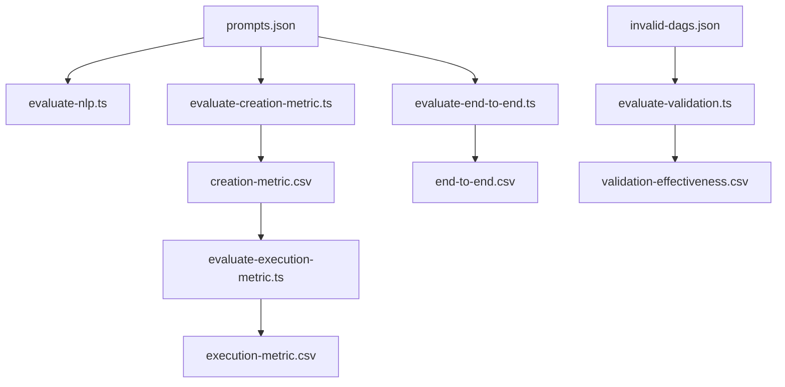

# Benchmark Validation Overview

This document outlines the validation and benchmarking process for the AI Automation Platform. The goal of this benchmark is to measure the accuracy, performance, and reliability of the end-to-end workflow generation and execution engine.

## 1. Evaluation Architecture

The benchmarking suite is composed of several specialized evaluators, each targeting a specific layer of the platform:

- **NLP Accuracy Evaluator** (`evaluate-nlp.ts`): Compares AI-generated workflows against a "golden" dataset.
- **Creation Metric Evaluator** (`evaluate-creation-metric.ts`): Measures the performance and success rate of the workflow creation API.
- **Execution Metric Evaluator** (`evaluate-execution-metric.ts`): Measures the reliability and latency of workflow execution.
- **Validation Effectiveness Evaluator** (`evaluate-validation.ts`): Tests the platform's ability to catch invalid or broken DAG (Directed Acyclic Graph) structures.
- **End-to-End Evaluator** (`evaluate-end-to-end.ts`): Runs the full pipeline from prompt to execution to final output verification.

## 2. Datasets

### Golden Prompts (`dataset/prompts.json`)
A dataset of 25+ real-world automation scenarios covering Marketing, IT, Sales, Document Ops, and Support. Each entry includes:
- `prompt`: The natural language request.
- `expected_nodes`: List of node types required.
- `expected_edges`: Required connections between nodes.
- `expected_variables`: Variables expected to be defined in nodes.
- `complexity`: (Easy, Medium, Hard).

### Invalid DAGs (`dataset/invalid-dags.json`)
A dataset used to test the robustness of the system's validation logic, including:
- Circular dependencies.
- Disconnected components.
- Missing required nodes (e.g., no trigger).
- Invalid node configurations.

## 3. Core Metrics

### NLP & Structural Accuracy
- **Node F1 Score**: Harmonic mean of precision and recall for generated node types.
- **Edge Accuracy**: Percentage of correct connections generated.
- **Variable Accuracy**: Correctness of variable names and mappings.

### Performance & Reliability
- **Generation Latency**: Time taken by the AI to stream the initial workflow structure.
- **Creation Latency**: Time to save the workflow to the database.
- **Execution Latency**: End-to-end time from trigger to successful completion.
- **Success Rate**: Percentage of workflows that execute without errors.

### Validation Effectiveness
- **Catch Rate**: Percentage of invalid DAGs correctly identified by the platform.
- **Classification Accuracy**: Ability to correctly label the type of validation error.

## 4. Benchmark Flow



## 5. API Endpoints Used

- `POST /api/workflow/stream?benchmark=true`: Streams AI-generated workflow components.
- `POST /api/workflow/create?benchmark=true`: Saves a workflow structure.
- `POST /api/benchmark/execute?benchmark=true`: Triggers a synchronous-like execution for testing.
- `GET /api/benchmark/execution-status/:id?benchmark=true`: Polls for execution results.
- `POST /api/benchmark/validate`: Runs structural validation on a provided workflow DAG.

## 6. How to Run

Benchmarks are typically executed using `ts-node` or through the project's task runner:

```bash
# Run NLP Accuracy
npx ts-node benchmark/scripts/evaluate-nlp.ts

# Run End-to-End Evaluation
npx ts-node benchmark/scripts/evaluate-end-to-end.ts
```

Results are stored as CSV files in the `benchmark/results/` directory for historical tracking and analysis.
